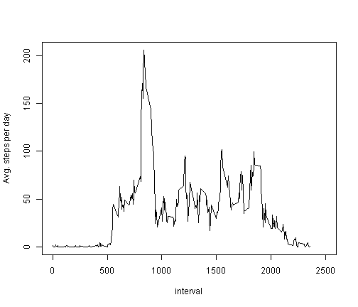

Activity Monitoring Analysis 
======================================================== 
This assignment makes use of data from a personal activity monitoring device. This device collects data at 5 minute intervals through out the day. The data consists of two months of data from an anonymous individual collected during the months of October and November, 2012 and include the number of steps taken in 5 minute intervals each day. 
 
Dataset: Activity monitoring data [52K] 
The variables included in this dataset are: 
steps: Number of steps taking in a 5-minute interval (missing values are coded as NA)      
date: The date on which the measurement was taken in YYYY-MM-DD format        
interval: Identifier for the 5-minute interval in which measurement was taken 

The dataset is stored in a comma-separated-value (CSV) file and there are a total of 17,568 observations in this dataset. 


Loading required libraries


```r
library(data.table)
library(ggplot2)
```


Read input file 

```r
ds = read.csv("activity.csv")
```

Removing NA values and creating clean data set

```r
ds1 = ds[complete.cases(ds),]
```


**What is mean total number of steps taken per day?**

Creating data.table based on clean data set. Then caluculating Total number of steps taken, mean
number of steps, median number of steps taken by each day.


```r
dt1 = data.table(ds1)
dt2=dt1[,list(tot_steps=sum(steps),mean_steps=mean(steps),median_steps=median(steps)),by=date]
```
 

plotting histogram of number of steps by date

```r
hist(dt2$tot_steps,xlab = "Total Steps per day",main = "Histogram of Total Steps per day") 
```

 

Calculating and report the mean and median total number of steps taken per day.

```r
mean(dt2$tot_steps)
```

```
## [1] 10766
```

```r
median(dt2$tot_steps)
```

```
## [1] 10765
```

**What is the average daily activity pattern?**

clauculating avg steps acorss days for each interval.


```r
dt3=dt1[,list(mean_steps=mean(steps)),by=interval]
```

Plotting a time series plot (i.e. type = "l") of the 5-minute interval (x-axis) and the average number of steps taken, averaged across all days (y-axis)


```r
plot(dt3$interval,dt3$mean_steps,type="l",xlab="interval",ylab="Avg. steps per day",xlim=c(0,2500))
```

 

5-minute interval, on average across all the days in the dataset, contains the maximum number of steps:


```r
dt3[dt3[,mean_steps==max(dt3$mean_steps)],]
```

```
##    interval mean_steps
## 1:      835      206.2
```

**Imputing missing values**

total number of missing values in the dataset (i.e. the total number of rows with NAs) are:


```r
sum(is.na(ds))
```

```
## [1] 2304
```

Strategy to fill in missing values: mean based on 5-minute interval across days.

Adding steps1 column to *ds* data frame filling NA values with mean for 5-minute interval caluculated earlier. 


```r
ds$steps1 = ds$steps

for(i in 1:nrow(ds)) {

    if (is.na(ds[i,"steps1"])==TRUE) {

        ds[i,"steps1"] = dt3[interval==ds[i,"interval"],mean_steps]
    }
}
```

Adding Weekday factor variable to *ds* data frame.


```r
ds$date1 = as.Date(ds$date)
ds$daytype=ifelse(weekdays(ds$date1) %in% c("Saturday","Sunday"),"Weekend","Weekday")
ds$daytype=as.factor(ds$daytype)
```

Creating data.table based on imputed data set. Then caluculating Total number of steps taken, mean
number of steps, median number of steps taken by each day.

```r
dt1 = data.table(ds)
dt2=dt1[,list(tot_steps=sum(steps1),mean_steps=mean(steps1),median_steps=median(steps1)),by=date]
```

**What is mean total number of steps taken per day?**
plotting histogram of number of steps by date

```r
hist(dt2$tot_steps,xlab = "Total Steps per day",main = "Histogram of Total Steps per day")
```

 

Calculating and report the mean and median total number of steps taken per day.

```r
mean(dt2$tot_steps)
```

```
## [1] 10766
```

```r
median(dt2$tot_steps)
```

```
## [1] 10766
```

There is no difference in mean values but slight difference in median value after filling in the missing values.


clauculating avg steps acorss days for each interval for imputed dataset


```r
dt3=dt1[,list(mean_steps=mean(steps1)),by=list(interval,daytype)]
```

Creating a panel plot containing a time series plot (i.e. type = "l") of the 5-minute interval (x-axis) and the average number of steps taken, averaged across all weekday days or weekend days (y-axis).


```r
qplot(interval,mean_steps,data=dt3,facets=daytype~.,geom=c("line"),ylab="Number of Steps")
```

 
